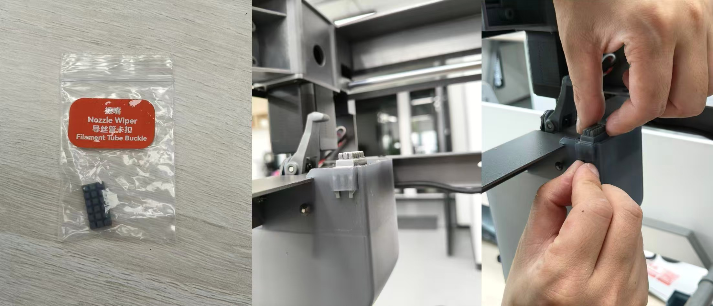
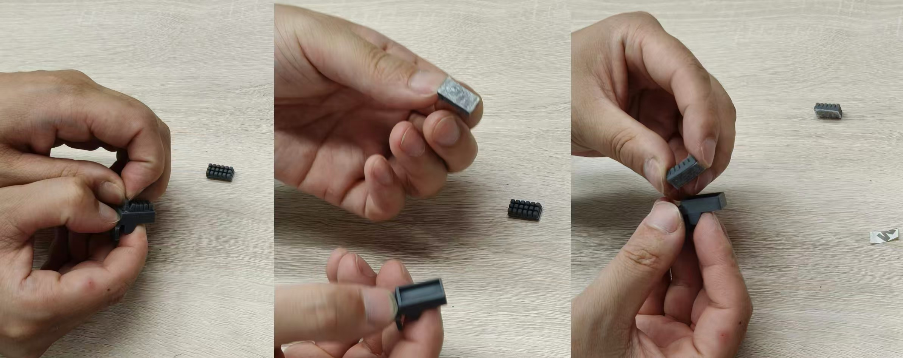
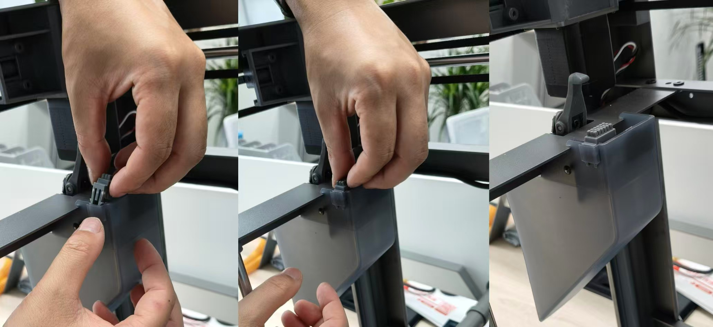

# 更换硅胶擦嘴

### **擦嘴组件维护**

擦嘴组件位于废料滑梯中，用于打印前或多色打印过程中清除喷嘴上的残余耗材。该组件会随时间磨损，建议定期检查，若发现损坏，则使用包装内备件更换。

**更换步骤：**&#x20;

找到工具包中的替换擦嘴，将擦嘴组件取下。

<figure><figcaption></figcaption></figure>

撕扯擦嘴组件上端将擦嘴取下，再将剥离背胶后的新擦嘴重新安装。

<figure><figcaption></figcaption></figure>

而后将换好擦嘴后的擦嘴组件对齐废料滑梯卡槽，卡入其中即完成擦嘴更换。

<figure><figcaption></figcaption></figure>
