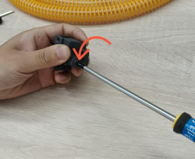

# 挤出机清理维护

挤出机应定期进行维护，挤出机组件对打印起到非常重要的作用。\
随着使用时间的积累，耗材碎屑、灰尘和其他进入挤出机中的颗粒会在挤出机内部逐渐积累，容易引起耗材打滑，影响出丝量可能会对打印质量造成影响。

挤出机脏污引起的常见问题：

* 1.打印纹理不一致
* 2.耗材堵塞
* 3.部件过早磨损

#### 所需工具和材料：

* 1.H2.0、H2.5六角扳手，十字螺丝刀，橡胶吹头或细毛刷，一段测试耗材
* 2.润滑油与润滑脂
* .jpeg>)

**重要提醒 ！**

在对打印机及其电子设备（包括工具头线缆）进行任何维护工作之前，请关闭打印机电源并断开电源连接，以避免发生电路短路从而引起额外的电子设备损坏和安全隐患。

在您对打印机进行维护或故障排查时，请先确认热端和热床的温度，避免在高温状态下操作，如果必须在高温状态下操作，请佩戴好隔热手套，以确保安全有效地执行维护工作。

**挤出机维护步骤（拆卸前需进行退丝操作，确保挤出机内无耗材）**

#### 从工具头中移除挤出机

打开工具头前盖小心地断开风扇的接口，如下图。

.jpeg>) .jpeg>) .png>)

拆下切刀部件（教程见切刀更换维护）

.png>) .jpeg>)

注意：拆卸螺丝时请确保螺丝刀垂直于螺丝头平面插入，确认刀头完全插入螺丝头后轻轻转动螺丝刀拧松该螺丝，避免使用螺丝刀时操作不当导致螺丝头滑牙。

拆下切刀部件后，轻轻拧松如图示的螺丝以松开PTFE管底座。

.png>) .jpeg>)

而后用H2内六角扳手松开固定喷嘴组件的2颗螺丝，将其与挤出机分离。

.jpeg>) .jpeg>)

#### 拆卸挤出机

用十字螺丝刀卸下固定挤出机的 3 颗螺丝后，取下挤出机。

.png>) .jpeg>)

.jpeg>) .jpeg>)

需要将图示螺丝拆下，此螺丝用于张紧挤出机齿轮。拧松该螺丝以释放弹簧的张力，然后您可以将白色齿轮向上轻轻拔出，另一侧的从动齿轮也采用同样的方法拆出。

 .jpeg>) .jpeg>)

.jpeg>) .jpeg>) .jpeg>)

**注意：如果拆齿轮时将轴承丢失，将无法正常挤出。**

#### 3. 清除挤出机外壳和挤出机齿轮上的碎屑

挤出机内部有很多灰尘。在重新组装挤出机之前，请确保所有灰尘都已清洁干净。\
您可以使用软毛刷和橡胶吹头对挤出机内部进行清洁。

<figure><figcaption></figcaption></figure>

挤出机润滑

在重新组装挤出机之前，可以对齿轮轴进行一些润滑。\
在挤出机齿轮的侧面和转轴上滴加少量润滑油，如下图所示。

<figure><figcaption></figcaption></figure>

接下来，您还可以在挤出机齿轮上涂上一点润滑脂或润滑油，如下图所示，润滑脂的润滑效果会更加持久。

<figure><figcaption></figcaption></figure>

\
确保涂抹均匀润滑剂，在齿轮安装回挤出机之前需要擦去如图所示多余部分。

<figure><figcaption></figcaption></figure>

最后，可以参照下图在轴承部分周围涂上少量的润滑油（以此来减少磨损）。

<figure><figcaption></figcaption></figure>

涂上润滑剂后，将齿轮部件装回（如图所示）。

<figure><figcaption></figcaption></figure>

<figure><figcaption></figcaption></figure>

然后手动拨动白色挤出机齿轮转动几次，以确保润滑剂的均匀涂覆并检查齿轮转动是否顺畅，安装挤出机的后盖。

<figure><figcaption></figcaption></figure>

拧紧挤出机张紧螺丝，在拧紧张紧螺丝时请确保弹簧和顶帽正确安装

<figure><figcaption></figcaption></figure>

而后将一段测试耗材插入挤出机中，来回拉扯耗材丝，测试是否安装正确。

<figure><figcaption></figcaption></figure>

### 安装挤出机

将挤出机安装回工具头，然后重新锁入 1、2、3 号螺丝以固定挤出机。

<figure><figcaption></figcaption></figure>

再将喷嘴组件插回挤出机底部，并旋紧螺丝。

<figure><figcaption></figcaption></figure>

接下来，按下图所示复位切刀刀柄并轻轻拧紧刀柄上的固定螺丝。

<figure><figcaption></figcaption></figure>

然后，将PTFE座插入挤出机顶部，并拧紧图示螺丝以固定PTFE料管底座。

<figure><figcaption></figcaption></figure>

最后，将冷却风扇的接线重新连接到接口板上。

<figure><figcaption></figcaption></figure>

**在此操作过程中，请格外小心，确保所有端子正确对齐后插入，部分端子可以在错误的状态下被按下，这会导致设备出现报错。**

### 通电测试

启动打印机，在触摸屏上完成一次手动进料和退料的操作，如果没有异常和报错，则说明挤出机已经正确的安装了。
