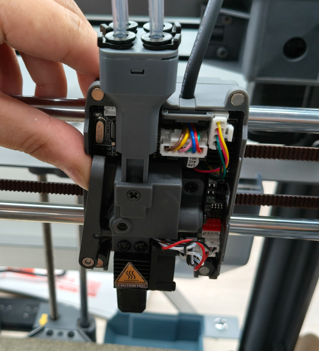

# 喷头切刀更换

喷头切刀更换维护

挤出机中使用的工具头切刀在换料过程切割耗材。 随换料次数多后，切刀的刀片会变钝，因此应定期检查以确保刀片仍然锋利。

更换步骤（切刀锋利，建议戴手套操作）（预先进行退丝操作）

1. 打开喷头盖板
2. 为方便后续操作建议先取下喷头冷却风扇部分

<figure><figcaption></figcaption></figure>

1. 用配送的H2.5六角扳手旋下如图示按压板的固定螺丝，

.png>)

1. 取下压板配件

<figure><figcaption></figcaption></figure>

1. 为方便操作可以先取下扭簧及固定螺丝，如图向下按压切刀，（注意：切刀锋利，此步骤请务必佩戴安全防护手套操作）

<figure><figcaption></figcaption></figure>

1. 卡入新的切刀部件

<figure><figcaption></figcaption></figure>

1. 将扭簧和螺丝装回按压板（如图示）

.png>)

1. 将扭簧一端针脚对准插入孔位。

 .png>)

1. 紧固螺丝旋2\~3圈（预固定）

.png>)

1. 将切刀插入孔位（注意位置，按图示位置装入），压板按入限位孔

 

1. 锁好紧固螺丝

1. 测试切刀按压板按压回弹是否灵活。

.png>) 

1. 安装冷却风扇接口

<figure><figcaption></figcaption></figure>

1. 合上喷头罩，完成。

<figure><figcaption></figcaption></figure>
