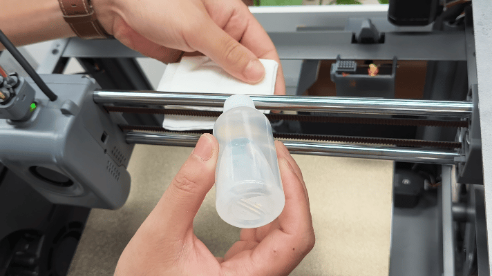
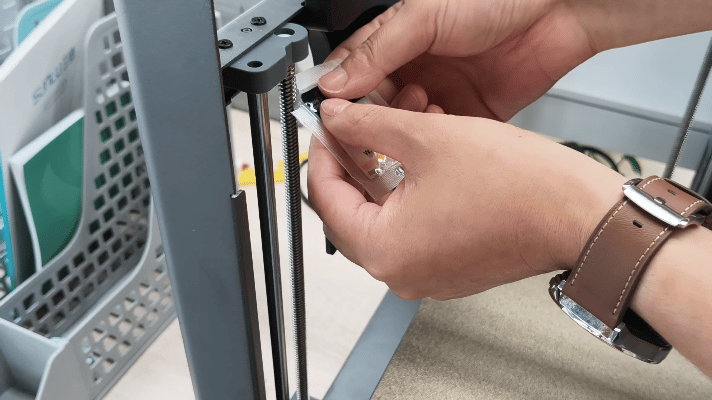
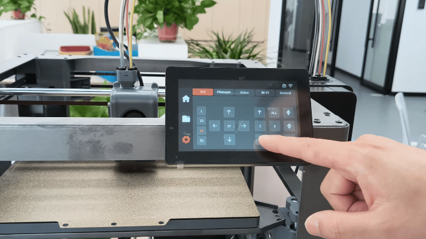

# xyz光轴及丝杆维护

设备使用300小时进行一次运动部件维护，建议同步重新调整皮带张力，以获得最佳效果。

**XY光轴清洁步骤：**

使用工具包中H2.5内六角扳手逆时针旋转，**松开**位于打印机上部固定皮带张紧轮的2颗螺丝，以便在清洁过程中更轻松地移动工具头并确保清洁结束后皮带张力均匀调整。

_❗特别注意：无需拆下螺丝，只需松动即可。_

<figure><figcaption></figcaption></figure>

使用干净的无纺布或纸巾，然后沿轴身方向轻轻擦拭，去除灰尘和污垢。建议重复 2–3 次，直至清洁布上不再有残留物。

 

在清理过程中，可将工具头沿X，Y轴方向多次移动以帮助完成彻底清洁。

 

然后在无纺布上滴少量润滑油，然后沿轴身擦拭，切勿过量，以免油滴在皮带上，影响张力。（可换GIF图5，6，7，8）

 

 

维护完成后，将工具头推至打印机后部，旋紧皮带张紧轮螺丝，直至感到轻微阻力，注意勿过度用力，以免损坏组件或引发打印问题。

<figure><figcaption></figcaption></figure>

### **Z 轴维护**

Z 轴有两类部件需定期维护：三根光轴和三根丝杆。

**光轴：**

首先将热床降至最低位置，用干净纸巾或无纺布擦拭每根光轴，去除灰尘和污垢。

在布上滴少量润滑油，沿光杆整体均匀擦拭，切勿过量，以免油滴落到轴承上。如滴落，请擦拭掉多余油脂，以免油脂过多粘附灰尘异物。

<figure><figcaption></figcaption></figure>

对所有三根线性杆重复上述操作，然后将热床升至最高位置。

**丝杆：**

使用配件包中金色小袋内的润滑脂，撕开小口，而后沿每根丝杆全长薄薄涂抹，切勿过量，以免在丝杆螺母下积聚。

对三根丝杆顶部和底部均涂抹后，通过屏幕按钮控制热床上下移动 ，或者手动上下移动热床2–3 次，使润滑脂均匀分布。

 

油脂堆积使用棉签/纸巾擦去多余润滑脂即可。

<figure><figcaption></figcaption></figure>

至此，Z 轴维护完成。

通过打印机菜单执行一次完整校准，即可恢复打印。
