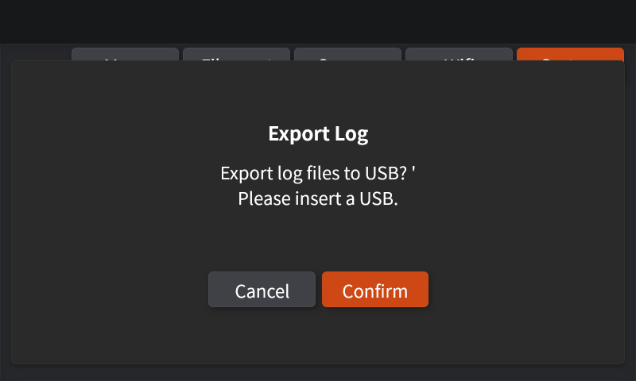
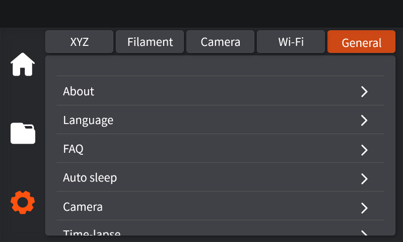
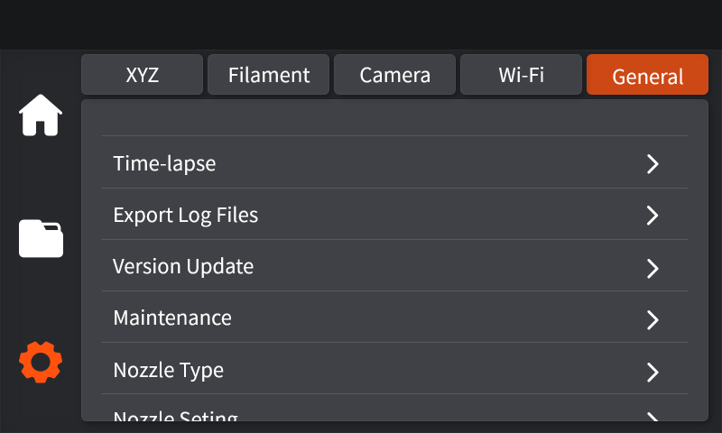
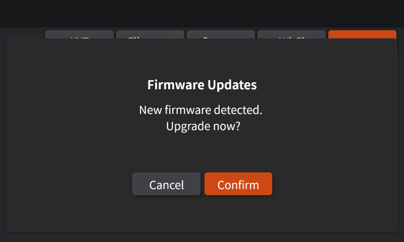
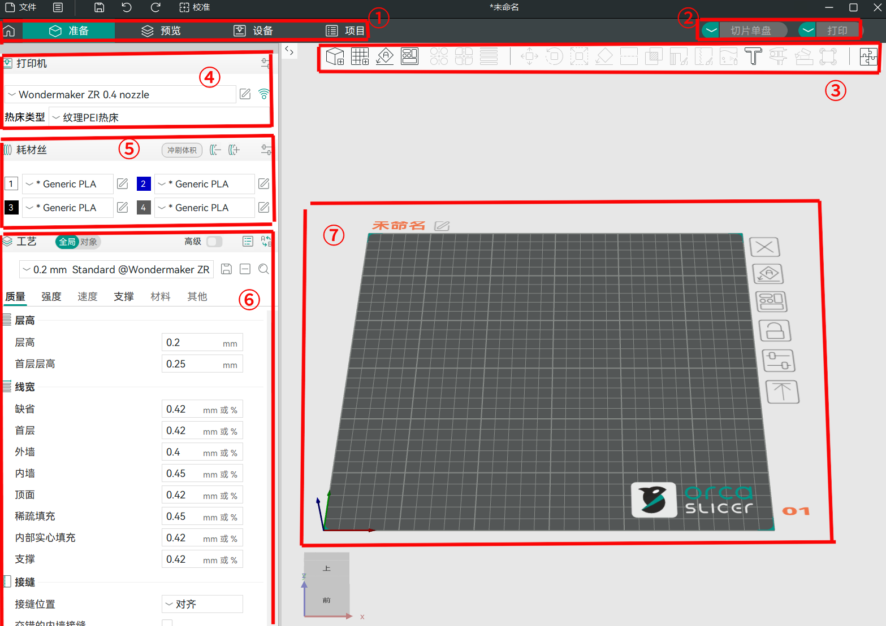
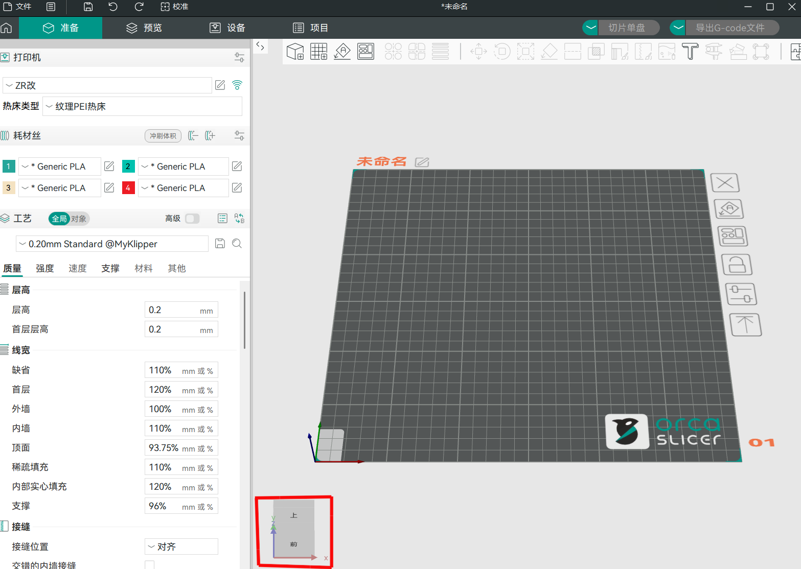

# Orca Slicer使用教程

Orca Slicer 快速使用教程

这篇文章简要介绍了Orca Slicer，并提供了一份指南，帮助您快速安装、设置、切片，并立即开始打印。

### 什么是 Orca Slicer?

**Orca Slicer** 是一款定制优化、功能丰富且易于使用的切片软件，旨在为用户带来流畅的打印体验。在打印功能上 Orca Slicer 支持**多色打印**，并具备自动优化耗材分组的功能，可有效减少材料浪费并提高打印效率。此外，用户还能通过该软件**远程控制和监视打印过程**，实现更高效的打印管理。

Orca Slicer 适用于 Windows、MacOS 和 Linux 操作系统，支持 .3mf、.stl、.stp、.step、.amf 和 .obj 等多种文件格式。

在 3D 打印领域，**切片软件**是连接数字创意与物理实物的关键桥梁。它将 3D 模型（如 STL、OBJ 或 3MF 格式）转化为 3D 打印机能识别的指令集——**G-code**。**“切片”**&#x7684;过程是将 3D 模型水平切割成数百甚至上千个薄层。对于每一层，切片软件会精确计算打印喷嘴的路径，包括移动位置、挤出耗材的时机、打印速度以及所需的温度等。它还会根据预设自动生成支撑结构、填充图案、墙层数等关键参数。

### 下载和安装

Orca Slicer 官方下载地址：https://orcaslicer.cn/Download/

进入该网页之后，您可以根据自己计算机操作系统下载对应的安装包。

#### 打印机选择

选择您希望在切片操作菜单中显示的打印机或喷嘴选项，可选择任何或所有可用选项。如果您在此阶段只选择一个喷嘴尺寸，可在稍后阶段通过切片器菜单调整这些选项。

#### 材料选择

选择您希望在材料预设列表中列出的材料，可选择尽可能多的材料。

### 首次打印

#### 打印机绑定

在发起打印任务之前，首先您需要完成 Orca Slicer 和打印设备的绑定，这样才能进行设备状态的查看、任务的远程发起与控制。

使用 IP 地址和访问码来绑定打印机（需要打印机在局域网模式下使用，适合数据隔离或无外网环境。）。

#### 创建新项目

点击主页**创建一个新项目**。

#### 添加模型

在预览窗格的顶部工具栏上，点击第一个图标①**添加**，以导入模型；也可将文件夹中的模型文件拖入模型界面②中导入。支持的文件包括 .3mf .stl .stp .step .amf .obj 格式。

#### 选择打印机/耗材丝/工艺预设

在模型切片前，需要选择您想使用的打印机和耗材丝，并对打印模型进行相关设置。

1. 点击**打印机**选择框，在列表中选择要使用的机型及喷嘴尺寸
2. 点击**耗材丝**选择框，在列表中选择您要使用的耗材类型
3. 点击**工艺**选择框，在列表中选择模型的层高。**层高越小，打印时间越长。对于大多数用0.4mm喷嘴打印的模型来说，0.20 mm的层高是合适的。**

### **准备界面**

进入准备界面，您可以看到以下 7 个主要部分。

**1. 标签栏**：包括六个标签，分别为首页、准备、预览、设备、项目。

**2. 执行栏**：负责执行切片和发起打印。

**3. 工具栏**：包含了一系列功能按钮，如添加模型、添加新盘、模型的移动，缩放，分割等。

**4. 打印机**：此处可以调整打印机硬件相关参数，涵盖打印机型号、打印板和喷嘴类型。

**5. 项目耗材列表**：可以在此添加、编辑或删除不同类型的耗材，并为每种耗材配置特定的打印参数，如喷嘴、热床温度等。

**6. 工艺**：用于调整打印过程中的各种参数，以优化打印质量、速度和强度等方面的表现。

**7. 模型界面**：3D 模型交互的核心区域，提供直观、便捷的模型展示和编辑。

### **模型视图操作**

在模型交互方面，您可以通过鼠标操作旋转、缩放和平移模型，以便从不同角度进行查看和编辑。

按住鼠标**左键**并拖动来旋转模型，按住右键**右键**并拖动来平移模型。

模型界面的缩放操作可通过滚动鼠标**滚轮**来实现。

您也可以借助相机导航工具，快速切换并精确调整观察视角，以便更高效地查看和编辑模型。

#### 模型切片

* 设置完成后，点击屏幕右上角的**切片单盘**。

* 如模型文件包含多盘，可点击屏幕右上角的**切片所有盘**。

完成后，屏幕将显示 .3mf 文件模型切片后的外观，右侧直方图还将显示模型的颜色方案、耗材丝用量、打印时间等信息。

#### 发送打印任务

**打印单盘**

点击屏幕右上角的**打印**，屏幕将弹出一个上传**打印任务**窗口。确认要发送的打印机，使用的耗材，以及打印机在打印开始前是否执行某些功能，如热床调平、流量校准等。选择完成后，点击上传并打印，即可开始打印。

<figure><figcaption></figcaption></figure>

### 远程控制

选择标签栏中的**设备**界面，可实时远程控制和监视打印。如果您的打印机上安装了摄像头，您还可以远程观看打印的实时画面。\

<figure><figcaption></figcaption></figure>
