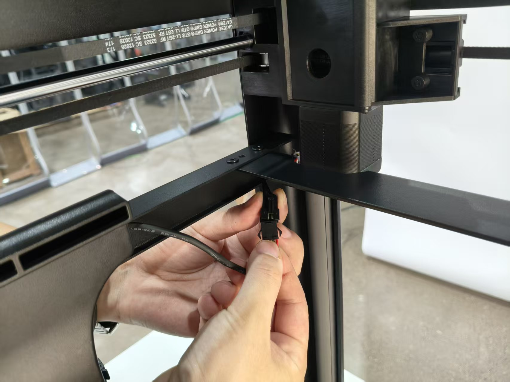
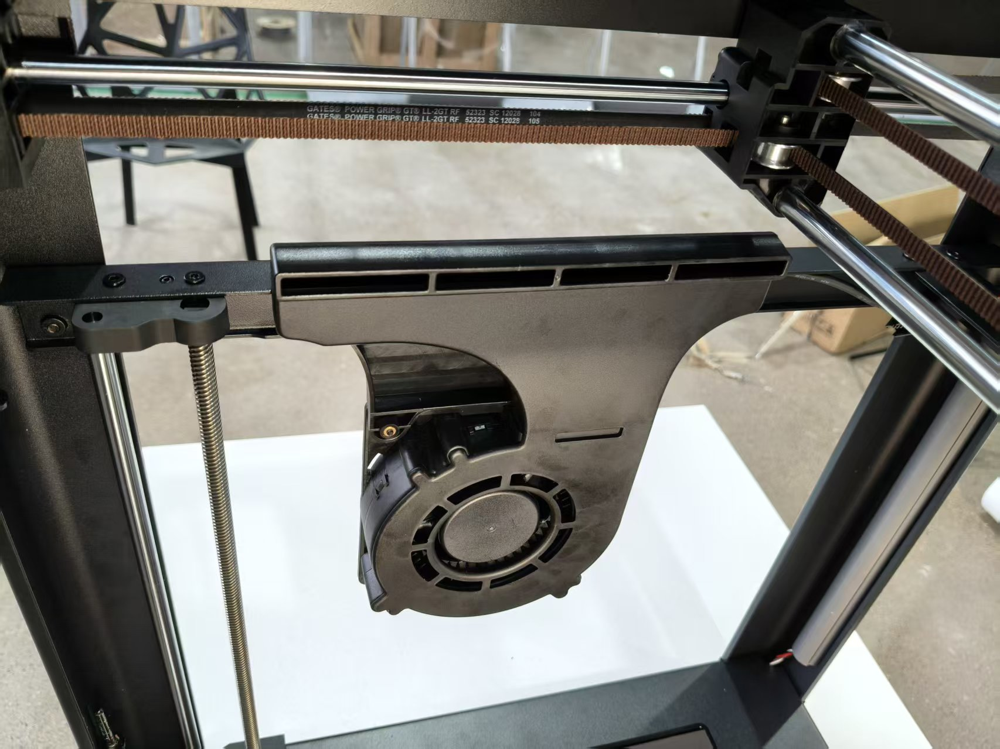

# 如何安装辅助风扇

1. 准备材料如下：辅助风扇，2.0内六角扳手，两颗螺丝（规格问孙工）

<figure><figcaption></figcaption></figure>

2. 将风扇出风口朝内，卡入钣金架凹槽内

<figure><figcaption></figcaption></figure>

<figure><figcaption></figcaption></figure>

3. 用2.0内六角扳手将风扇与钣金架固定

<figure><figcaption></figcaption></figure>

4. 将风扇接线口与钣金架预留线对接，注意朝向

<figure><figcaption></figcaption></figure>

<figure><figcaption></figcaption></figure>

5. 完成风扇安装

<figure><figcaption></figcaption></figure>

<figure><figcaption></figcaption></figure>
