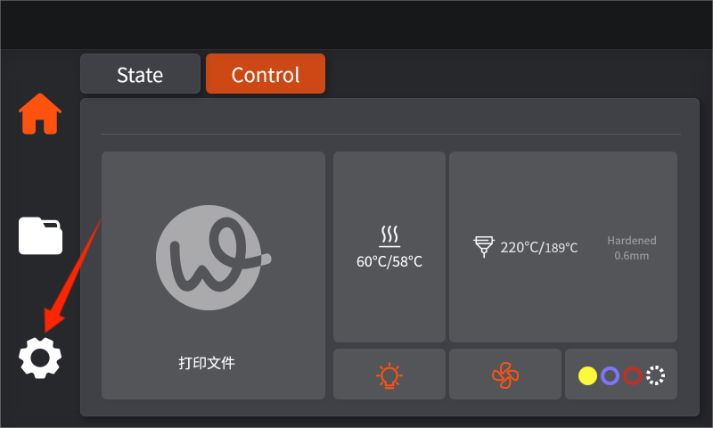
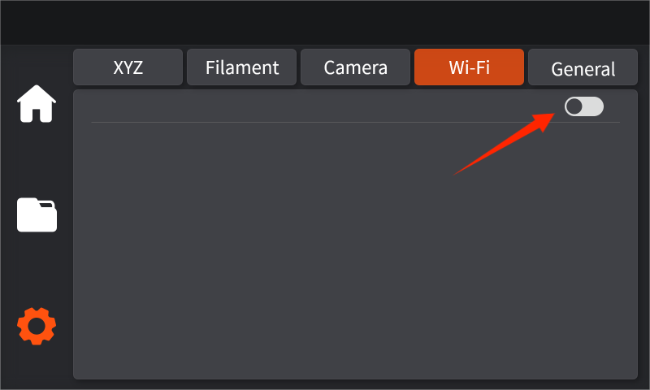
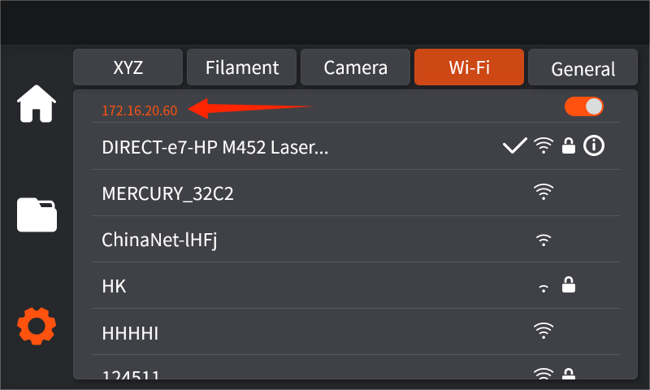

# 如何初次连接ZR打印机

1. 打开设备点击设置按钮

<figure><figcaption></figcaption></figure>

2. 找到WIFI设置-点击可以连接的WiFi输入密码登入

<figure><figcaption></figcaption></figure>

<figure><figcaption></figcaption></figure>

3. 连接成功后记下设备的ip地址

<figure><figcaption></figcaption></figure>

4. 打开Orca Slice，点击wifi连接

.png>)

5. 输入您设备上的显示的ip地址，点击确认

.png>)

6. 连接成功后，可在软件中的设备功能区看到打印机的实时画面以及当前状态

.png>)

7. 或在切片完成后，直接传输文件进行打印

.png>)
