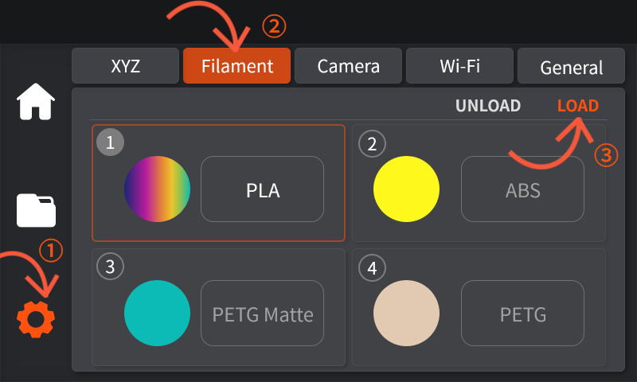
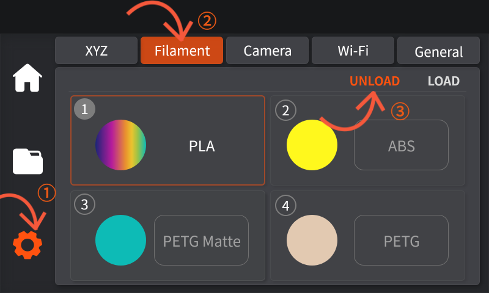

# 如何装入，退出耗材

### 如何装入耗材：

1. 首先，撕开料材塑料包装，取出料材（请勿提前解开固定料线的绑带）。

<figure><figcaption></figcaption></figure>

2. 将料材盘放到料盘支架上，将料线头从料盘的孔洞中取出，并将前端弯曲部分剪去（若料线两端与料盘间存在缝隙请手动按压料线边缘，至缝隙填满，以防止出现卡线的情况）。

<figure><figcaption></figcaption></figure>

3. 撕开固定耗材的保护带并将其抽出，将料线头插入耗材分离器中。

<figure><figcaption></figcaption></figure>

4. 手动推动线料穿入四色盒子来到上端的透明的导丝管中，直至导管末端。

<figure><figcaption></figcaption></figure>

5. 在触摸屏的设置界面中点击耗材-进料，部分料材会从喷头中溢出，进入废料盒，而后取消进料，即完成耗材安装。

<figure><figcaption></figcaption></figure>

### 如何退出耗材：

1. 在触摸屏的设置界面中点击耗材-退料，料材会从喷头中退出至透明导丝管中。

<figure><figcaption></figcaption></figure>
