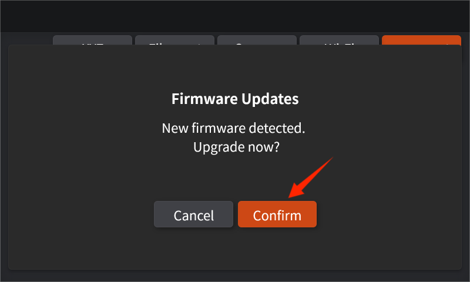

# 如何进行固件升级

1. 点击进入设置界面，点击并连接Wi-Fi，请确保在联网状态下进行升级操作。

<figure><figcaption></figcaption></figure>

<figure><figcaption></figcaption></figure>

2. 连接网络后，点击General，将选项下滑找到并点击Version Update

<figure><figcaption></figcaption></figure>

3. 点击确认后，即开始进行固件的升级

<figure><figcaption></figcaption></figure>

4. 观察进度条，等待几分钟后出现如下界面，即为固件升级完成

<figure><figcaption></figcaption></figure>

<figure><figcaption></figcaption></figure>

5. 最后回到设置界面，依次点击General-About，查看版本的升级情况

<figure><figcaption></figcaption></figure>

<figure><figcaption></figcaption></figure>
