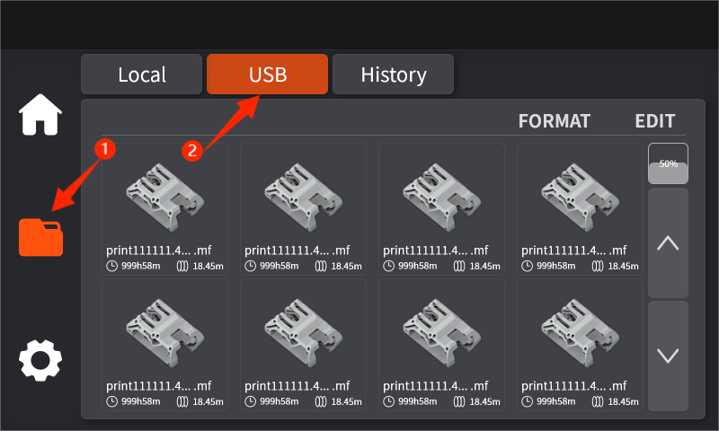

# 如何使用U盘进行打印

1. 打开切片软件，将需要打印的模型文件直接拖到模型界面的打印板内，或者点击文件-打开项目选择电脑内的模型文件。

.png>) .png>)

2. 设置好基础切片参数（①）后，在左上角标签栏中点击预览（②），将模型进行切片处理。

.png>)

3. 在屏幕左上角点击文件-导出-导出G-code文件，将模型文件另存到U盘中。

.png>) .png>)

4. 将U盘插入触摸屏右端USB接口处，点击来到文件界面，选择USB文件，点击需要打印的模型文件，即可开始打印。（将文件复制到本地便可在打印过程中拔出U盘）

<figure><figcaption></figcaption></figure>

<figure><figcaption></figcaption></figure>
