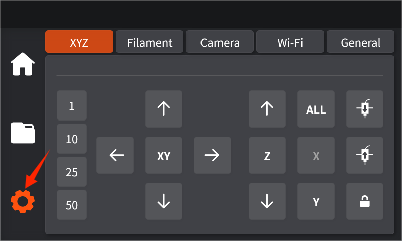
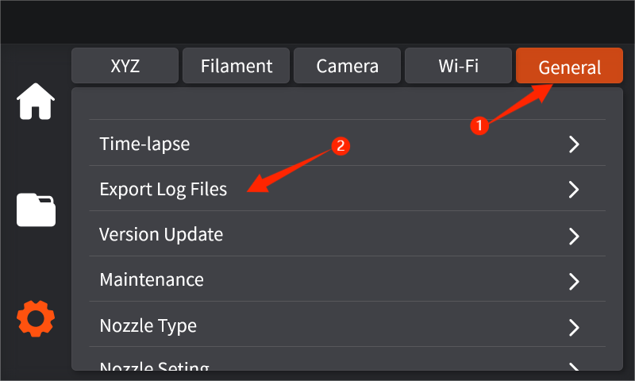
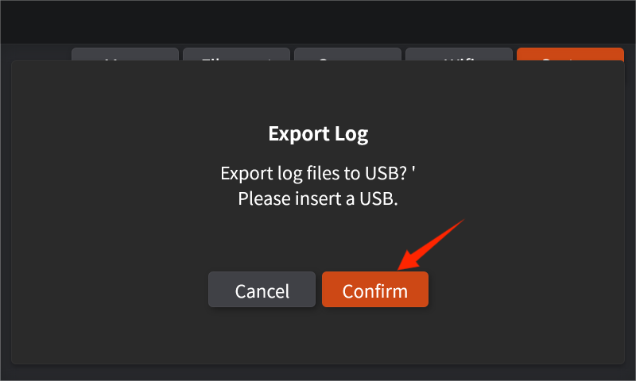

# 如何通过U盘导出日志文件

1. 将U盘插入触摸屏右端USB接口处，点击来到设置界面

<figure><figcaption></figcaption></figure>

2. 点击General，下滑找到Export Log Files

<figure><figcaption></figcaption></figure>

3. 点击确认后，等待进度条加载完成

<figure><figcaption></figcaption></figure>

<figure><figcaption></figcaption></figure>

4. 出现如下画面为成功导出日志文件

<figure><figcaption></figcaption></figure>

