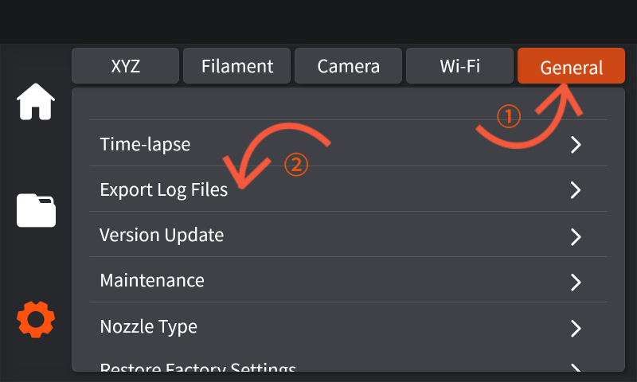

# 如何通过U盘导出日志文件

1. 将U盘插入触摸屏右端USB接口处，点击来到设置界面。

.png>) .png>)

2. 点击General，下滑找到Export Log Files。

<figure><figcaption></figcaption></figure>

3. 确认后出现如下界面，待进度条加载完成后，即成功导出日志文件。

<figure><figcaption></figcaption></figure>
